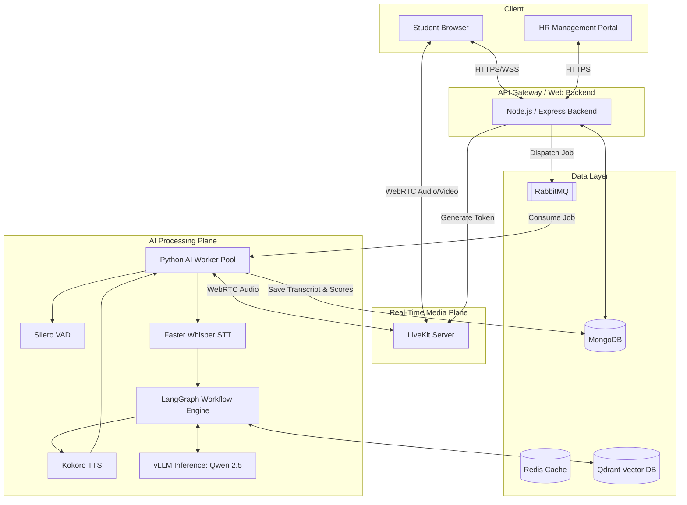
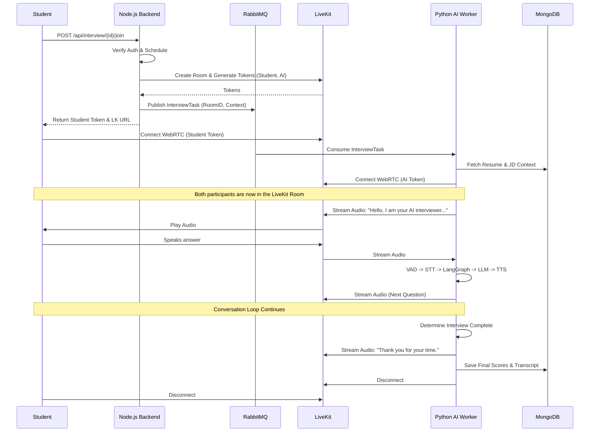
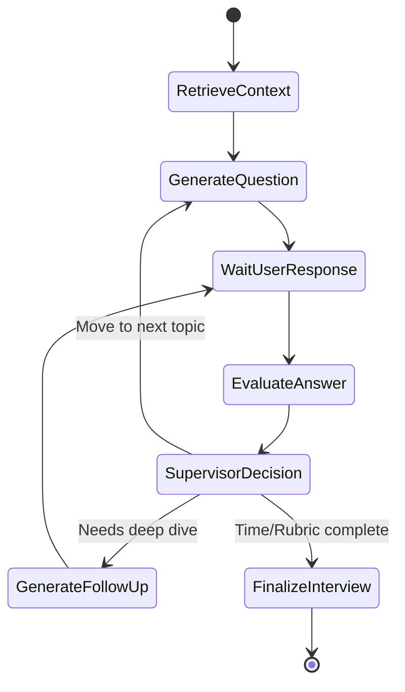
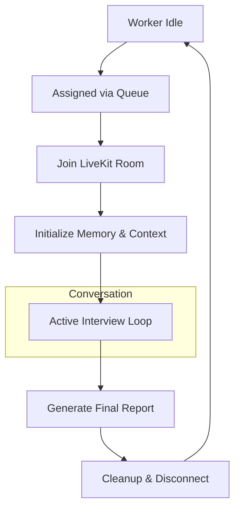

# Software Architecture Design Document (SAD)
## Module: AI Interview System
**Author:** Senior Software Architect
**Date:** August 2026

---

## 1. Module Overview

The AI Interview Module is an advanced, real-time conversational AI subsystem integrated into the existing Placement Management Platform. Its primary purpose is to conduct autonomous, highly realistic voice-based interviews with students. 

This module does not exist in isolation; it acts as a specialized extension of the current platform. It interfaces with existing modules such as:
* **User & Authentication Module:** To verify student identity and HR authorization.
* **Resume & Profile Module:** To fetch candidate context for the AI.
* **Job/Company Module:** To fetch Job Descriptions (JD) and interview rubrics.
* **Interview Scheduling Module:** To attach AI sessions to scheduled calendar events.

By tightly coupling with the existing platform, the AI Interview Module acts as an automated proxy for HR professionals, conducting the initial screening and deep-dive technical evaluations before human intervention is required.

---

## 2. Business Goals

### Objectives
* **Automate Initial Interview Screening:** Allow companies to conduct first-round interviews efficiently, freeing up human HR for later stages.
* **Standardize Evaluation:** Eliminate human bias by enforcing consistent, rubric-based evaluation for every candidate.
* **Enhanced Candidate Experience:** Provide students with immediate, flexible scheduling and a low-stress environment to showcase their skills.

### Expected Outcomes & Problems Solved
Currently, the platform relies heavily on manual scheduling and human availability, leading to high time-to-hire metrics. This module solves the "funnel bottleneck" by allowing a significantly larger number of candidates to complete interviews without requiring continuous interviewer availability, surfacing only the top percentile to human recruiters based on deep semantic analysis of their conversational performance.

### Success Criteria
* Minimized conversational latency for a natural experience.
* Stable WebRTC connections during active interviews.
* >90% correlation between AI-generated scores and subsequent human HR evaluation scores.

---

## 3. Functional Requirements

* **Live Voice Interaction:** The system must support real-time, bi-directional audio streaming between the student and the AI.
* **Dynamic Interruption Handling:** The AI must stop speaking immediately if the student interrupts (barge-in).
* **Contextual Awareness:** The AI must ask questions specifically tailored to the student's uploaded resume and the target Job Description.
* **Automated Evaluation:** The system must generate a comprehensive rubric-based score (Technical, Behavioral, Communication) immediately after the interview concludes.
* **HR Configuration:** HR must be able to configure the difficulty level and configure interview focus areas.
* **Interview Artifacts:** The system must generate a full text transcript, a conversational timeline, and granular analytics for HR review.

---

## 4. Non-Functional Requirements

* **Performance & Latency:** The system should minimize end-to-end response latency to provide a natural conversational experience.
* **Scalability:** The architecture should support horizontal scaling to handle increasing numbers of concurrent interview sessions.
* **Reliability:** Audio state must degrade gracefully (e.g., dropping to lower bitrates) on poor student networks without disconnecting the session.
* **Availability:** The AI Worker pool must be highly available; if an AI worker crashes mid-interview, another worker should resume the interview from the latest checkpoint whenever possible.
* **Maintainability:** The AI reasoning logic (LangGraph) must be strictly decoupled from the media transport layer (LiveKit) to allow independent updates to prompts and models.
* **Extensibility:** The system must support adding new modalities (e.g., AI analyzing a shared screen for coding interviews) in the future.
* **Security:** All media streams must be End-to-End Encrypted (E2EE) via WebRTC. Transcripts and evaluation data must be encrypted at rest in MongoDB.

---

## 5. High-Level Architecture

The architecture separates the signaling/media plane from the AI inference plane, ensuring that heavy AI workloads do not impact the web application's responsiveness.



### Component Responsibilities & Communication
* **Node.js Backend:** Handles business logic, authentication, and orchestrates the creation of interviews. It communicates with LiveKit via REST to generate tokens and with RabbitMQ to dispatch AI workers.
* **LiveKit Server:** Acts as the Selective Forwarding Unit (SFU). It manages WebRTC connections, routing audio from the student to the Python Worker and vice versa.
* **Python AI Worker:** Subscribes to LiveKit rooms. It acts as the "glue", running the audio through VAD, STT, the LangGraph reasoning engine, and finally TTS, piping the generated audio back to LiveKit.

---

## 6. Component Architecture

### Frontend (Next.js, React, Tailwind)
* **Responsibility:** Renders the Interview Room UI, visualizes audio levels, and displays real-time captions via LiveKit Data Channels.
* **Communication:** Connects to Node.js for auth/tokens, and to LiveKit via `@livekit/components-react`.

### Backend (Node.js, Express)
* **Responsibility:** Manages the lifecycle of an interview entity. Enforces RBAC.
* **Communication:** Writes application data to MongoDB, caches session data in Redis, and pushes async tasks to RabbitMQ.

### AI Worker (Python, LiveKit Agents)
* **Responsibility:** The core intelligence. It is a long-running process that listens to RabbitMQ. When a job arrives, it joins the specified LiveKit room and initiates the LangGraph pipeline.

### Database Layer
* **MongoDB:** Acts as the primary database. Stores core platform entities (Users, Interview Schedules, Configs, Final Scores) as well as high-volume unstructured data (Interview Transcripts, granular timeline events).
* **Qdrant:** Stores dense vector embeddings of Resumes and Job Descriptions for RAG.

### AI Models (vLLM, Faster Whisper, Kokoro)
* **Responsibility:** Specialized inference. `vLLM` hosts Qwen 2.5 for text generation. Faster Whisper handles STT. Kokoro TTS handles voice generation.

---

## 7. Complete Interview Flow

This sequence diagrams the exact state transitions and API interactions during a live interview.



---

## 8. LiveKit Architecture

LiveKit is chosen because of its first-class support for AI Agents (`livekit-agents` SDK) and robust server-side state management.

* **Room Creation:** Managed server-side by Node.js. Rooms are strictly ephemeral and destroyed when empty.
* **Authentication:** Node.js generates cryptographically signed JWTs. The student's token grants `canPublish` and `canSubscribe`. The AI's token has a hidden `agent` identity.
* **Media Flow:** Student audio is captured by the browser, sent via WebRTC to LiveKit (SFU), which forwards it to the Python Worker. The worker processes it and sends audio back to LiveKit, which forwards to the student.
* **Data Channels:** Used for side-band communication. The Python Worker streams STT text over a Data Channel so the React frontend can render live captions. It also sends JSON states (e.g., `{"state": "thinking"}`) to trigger UI animations.
* **Room Cleanup:** Configured with `empty_timeout`. If the student disconnects and doesn't reconnect within 60 seconds, LiveKit automatically closes the room and fires a webhook to Node.js.

---

## 9. AI Architecture

The intelligence is strictly modularized into specialized agents within LangGraph to prevent prompt bloating and hallucination.

* **Supervisor Agent:** The router. Analyzes the current conversation state and decides whether to invoke the Interview Agent, Follow-up Agent, or Evaluation Agent.
* **Interview Agent:** Responsible for progressing the interview timeline. It pulls the next major topic from the HR's configured rubric.
* **Follow-up Agent:** A reactive agent. It analyzes the student's immediate answer, finds logical gaps, and formulates deep-dive follow-up questions.
* **Evaluation Agent:** A silent background agent. After every student response, it asynchronously evaluates the answer against the rubric and updates the running `Interview Memory`.
* **Recommendation Agent:** Runs only at the end of the interview. Synthesizes all data to generate the final "Hire / No Hire" recommendation.
* **Report Agent:** Consolidates evaluations, transcripts, and metadata into a comprehensive JSON report for the HR Management Portal.

---

## 10. LangGraph Workflow

LangGraph orchestrates the state machine of the interview. It manages memory and conditional routing.



* **Memory:** Uses a persistent checkpoint mechanism to save the conversation thread. If a worker fails, a new worker can load the checkpoint and resume seamlessly.
* **Error Handling:** If the LLM returns malformed JSON during an internal evaluation, LangGraph edges are configured with automated retries (up to 3 times) before falling back to a graceful error phrase ("Could you repeat that?").

---

## 11. Voice Processing Pipeline

Achieving low latency requires an asynchronous, streaming pipeline. 

1. **Silero VAD:** Continuously scans the incoming audio stream chunks (10ms). When speech is detected, it opens a buffer. When 500ms of silence is detected, it closes the buffer.
2. **Speech-to-Text (Faster Whisper):** The buffer is immediately transcribed.
3. **Conversation Management & Interruption:** If the AI is currently speaking (TTS streaming) and Silero VAD detects the student speaking, the system immediately **halts the TTS stream** and clears the playout buffer. This enables natural "barge-in" interruptions.
4. **LLM (vLLM Qwen 2.5):** The transcript is sent to LangGraph. The LLM generates the response with `stream=True`.
5. **Text-to-Speech (Kokoro):** As soon as the LLM yields the first sentence (e.g., parsing for punctuation), Kokoro TTS begins generating audio for that chunk.
6. **Streaming out:** The audio chunks are piped directly into the LiveKit audio track while the LLM is still generating the rest of the response. This pipelining is the key to latency optimization.

---

## 12. Memory Architecture

An interview requires distinct layers of memory to remain coherent over time.

* **Short-Term Memory (Conversation Window):** Stores the last 5-10 turns of dialogue. Managed dynamically by LangGraph's message state.
* **Long-Term Memory (Interview State):** A structured JSON object maintained in Redis detailing completed topics, identified skills, and running scores.
* **Evaluation Memory:** A separate parallel state that aggregates the hidden scores assigned by the Evaluation Agent after each answer.
* **State Persistence:** All memory states are flushed to MongoDB asynchronously to ensure no data loss in case of a crash.

---

## 13. Retrieval-Augmented Generation (RAG)

To ensure the AI asks highly relevant questions, it uses RAG against the candidate's Resume and the Job Description.

* **Chunking Strategy:** Resumes are parsed and chunked semantically (e.g., "Experience Block 1", "Education Block"). JDs are chunked by "Requirements" and "Responsibilities".
* **Embedding:** BAAI BGE-M3 is used for generating high-quality multilingual embeddings.
* **Vector Indexing (Qdrant):** Embeddings are stored in Qdrant with payload metadata `{"student_id": "123", "job_id": "456"}`.
* **Retrieval Strategy:** When the Supervisor Agent decides to transition to a new topic (e.g., "Database Knowledge"), the RAG node performs a similarity search in Qdrant to pull the student's specific database experience and the JD's database requirements.
* **Context Construction:** The retrieved context is injected into the LLM prompt as system instructions before generating the question.

---

## 14. Evaluation Engine

The Evaluation Engine operates completely asynchronously from the conversational loop so it does not block the AI's response time.

* **Scoring Methodology:** Uses a rigid, Few-Shot prompted LLM evaluator. It scores answers on a 1-10 scale across vectors: Technical Accuracy, Communication Clarity, Problem Solving, and Behavioral Alignment.
* **Aggregation:** Scores are weighted based on HR configuration.
* **Output:** Generates a structured JSON report containing:
  - Overall Score (0-100)
  - Radar chart data (Strengths/Weaknesses)
  - Hiring Recommendation (Strong Hire, Hire, No Hire)
  - Quote highlights (Extracting the best/worst things the candidate said).

---

## 15. Interview Types

The architecture supports polymorphic interview structures via **Templates**.

* **Template Structure:** A JSON schema stored in MongoDB defining the LangGraph routing logic and base prompts.
* **Technical:** heavily weights RAG retrieval from the Resume and forces the Supervisor Agent to favor the Follow-up Agent to drill deep into architectures.
* **Behavioral:** Uses the STAR method (Situation, Task, Action, Result). The Evaluation Engine specifically penalizes answers that lack quantifiable results.
* **Custom:** HR can define custom topics which dynamically adjusts the nodes the Supervisor Agent traverses.

---

## 16. Database Design

### MongoDB Collections (Primary Database)
* **`interviews` collection:** `{ _id, student_id, job_id, status: "scheduled" | "in_progress" | "completed", scheduled_at }`. Indexed on `job_id` and `student_id`.
* **`interview_configs` collection:** `{ _id, job_id, interview_type, difficulty_level, focus_areas }`.
* **`interview_results` collection:** `{ _id, interview_id, overall_score, recommendation, created_at }`. Indexed heavily on `job_id` and `overall_score` for fast HR sorting and filtering.
* **`interview_transcripts` collection:** Stores an array of utterance objects `{ interview_id, utterances: [{role: "ai", text: "...", timestamp: "..."}] }`.
* **`interview_analytics` collection:** Stores fine-grained timeline events (e.g., `user_interrupted_ai`, `silence_duration_seconds`).

---

## 17. Queue Architecture

RabbitMQ decouples the web tier from the AI tier.

* **Background Jobs:** When a student joins a room, a `StartInterviewJob` is published.
* **Worker Assignment:** Python AI Workers act as consumers. They pull jobs from the queue to process interviews.
* **Dead Letter Queue (DLQ):** If a worker crashes while processing a job, the message is NACKed and routed to a DLQ. A supervisor service monitors the DLQ and attempts to re-queue the job to a healthy worker.

---

## 18. Recording & Transcript Architecture

* **Synchronization:** Because STT processes audio in chunks, the transcript timestamps must be synchronized accurately to the start of the interview.
* **Storage:** Recording metadata is stored by the application. Actual storage implementation for the media files depends on deployment configuration.
* **Timeline Integration:** The React frontend plays back the video while simultaneously seeking through the MongoDB transcript array, highlighting the spoken text in real-time.

---

## 19. Security

* **Authentication:** Next.js backend issues short-lived JWTs for the platform, and extremely short-lived LiveKit Access Tokens.
* **Authorization:** Strict Role-Based Access Control (RBAC). Students can only query `/api/interviews/me`. HR can query `/api/jobs/{id}/interviews`.
* **Encryption:** LiveKit ensures all media is E2EE in transit. The MongoDB database is encrypted at rest.
* **Rate Limiting:** Redis-backed rate limiting on all API endpoints to prevent DDoS, particularly on the resource-heavy `/join` endpoints.

---

## 20. Failure Recovery

* **Worker Failures:** If a Python worker crashes, the LiveKit server detects the participant disconnect. Node.js receives a webhook, checks if the interview status is still `in_progress`, and immediately dispatches a high-priority "ResumeInterviewJob" to RabbitMQ. A new worker boots, loads the LangGraph checkpoint, and says, "Sorry about that, my connection dropped. As we were saying..."
* **LLM Failures:** If the LLM throws a 500 or times out, the LangGraph node catches the exception and yields a fallback state, causing the AI to say, "I need a moment to process that," while a background retry executes.
* **Unexpected Disconnects:** If the student's internet drops, LiveKit preserves the room for a grace period. The AI worker is paused. If the student reconnects, the worker resumes.

---

## 21. Scalability

The architecture is designed to handle thousands of concurrent interviews.

* **Media Scaling:** Additional LiveKit nodes can be spun up, and rooms will automatically load-balance.
* **Compute Scaling:** The Python AI Workers are stateless regarding the web application. We can scale the worker pool horizontally based on RabbitMQ queue depth.
* **Vector Search Scaling:** The vector database can scale horizontally as the volume of candidate resumes grows.

---

## 22. Extensibility

The decoupled nature of this architecture allows for profound future extensions without major rewrites.

* **Coding Interviews:** We can introduce a shared Yjs-based CRDT code editor in the React frontend. The contents of the editor can be streamed to a new `CodeAnalysisAgent` in LangGraph via LiveKit Data Channels, allowing the AI to watch the student code in real-time and provide hints.
* **Multilingual Interviews:** By swapping the Faster Whisper model for a multilingual variant and updating the Kokoro TTS voice payload, the platform can conduct interviews in multiple languages simply by passing a `locale` flag in the `InterviewConfig`.
* **AI Avatars:** Support animated AI avatars in future to generate a realistic video feed of the AI interviewer, streamed seamlessly back into the LiveKit room.

---

## 23. API Architecture

The AI Interview module exposes several REST endpoints to handle the lifecycle of an interview session.

* **`POST /api/interviews`**: Creates a new interview session (HR/System).
* **`GET /api/interviews/:id`**: Retrieves details about a specific interview session.
* **`POST /api/interviews/:id/join`**: Authenticates the student, generates LiveKit tokens, and publishes the start event to the queue.
* **`GET /api/interviews/:id/transcript`**: Fetches the synchronized conversation transcript from MongoDB.
* **`GET /api/interviews/:id/report`**: Fetches the final evaluation report and scoring data.
* **`GET /api/interviews/:id/analytics`**: Retrieves fine-grained metrics like speaking time ratios, interruption counts, and silence durations.

---

## 24. State Management

The interview progresses through a highly structured state machine, tracked in MongoDB and cached in Redis.

* **Scheduled**: The interview is created but has not yet begun.
* **Waiting**: The student has joined the waiting room, and the system is verifying constraints (e.g., identity verification, hardware checks).
* **Preparing**: The system has allocated a LiveKit room, and the AI worker is actively retrieving context (Resume, JD).
* **Interview Started**: Both the Student and AI have joined the room.
* **Listening**: The AI is passively waiting for the student to finish speaking (VAD is monitoring).
* **Thinking**: The student has stopped speaking; LangGraph and the LLM are generating the response.
* **Speaking**: The Kokoro TTS engine is streaming audio back to the student.
* **Generating Report**: The conversation has concluded, and the Evaluation/Report agents are running final synthesis.
* **Completed**: All reports are saved, and HR can review the results.
* **Cancelled**: The interview was aborted by HR or the Student before completion.
* **Failed**: An unrecoverable system error occurred (e.g., prolonged student disconnect).

---

## 25. AI Worker Lifecycle

The Python AI Worker follows a strict operational lifecycle to ensure predictable resource consumption and state integrity.



---

## 26. Module Integration

The AI Interview Module relies on well-defined interfaces with existing platform systems.

* **Authentication Module:** Reuses the existing JWT strategy. When `POST /api/interviews/:id/join` is called, the middleware verifies the student's identity before issuing a LiveKit token.
* **Student Module:** Validates student eligibility and fetches their canonical profile data.
* **Resume Module:** Provides the raw text or parsed JSON of the student's resume, which the AI Worker indexes into Qdrant for RAG.
* **Company / Job Module:** Provides the Job Description, required skills, and the HR-configured interview rubric.
* **Scheduling Module:** Ensures the interview is occurring within the allowed time window and handles calendar syncing.
* **Analytics Module:** Absorbs the raw `interview_analytics` data to generate aggregate reports for HR (e.g., "Average candidate score for Job X").

---

## 27. Folder Structure

The implementation will follow a strict domain-driven folder structure within the backend and AI worker repositories.

**Backend (Node.js)**
```text
src/
 ├── application/
 │    └── usecases/
 │         └── ai-interview/       # Interview lifecycle logic
 ├── domain/
 │    └── entities/
 │         └── Interview.ts        # Core interview entity
 ├── presentation/
 │    └── http/
 │         └── controllers/
 │              └── interview.controller.ts
 └── infrastructure/
      ├── livekit/                 # Token generation and webhooks
      └── queue/                   # RabbitMQ publishers
```

**AI Worker (Python)**
```text
src/
 ├── agents/                       # Specialized LangGraph agents
 │    ├── supervisor.py
 │    ├── interviewer.py
 │    └── evaluator.py
 ├── core/
 │    ├── livekit_worker.py        # LiveKit connection and audio streaming
 │    └── memory.py                # Checkpoint persistence
 ├── rag/
 │    ├── embeddings.py            # BGE-M3 integration
 │    └── vector_store.py          # Qdrant client
 └── config/                       # Prompts and LLM configuration
```

---

## 28. Configuration Management

HR and System Administrators can heavily configure the behavior of the AI Interview Module without altering code.

* **Model Config:** Selects which LLM (e.g., Qwen 2.5 7B) and TTS models are used for a specific session.
* **Interview Config:** Determines the difficulty level, interview duration, and allowed topic paths.
* **Prompt Config:** System prompts injected into the Supervisor and Interview agents (e.g., "Act as a strict senior engineer").
* **Voice Config:** Selects the specific Kokoro TTS voice payload (e.g., male, female, specific accent) to use.
* **Evaluation Config:** Defines the scoring rubric, weights (e.g., 60% Technical, 40% Behavioral), and pass/fail thresholds.
