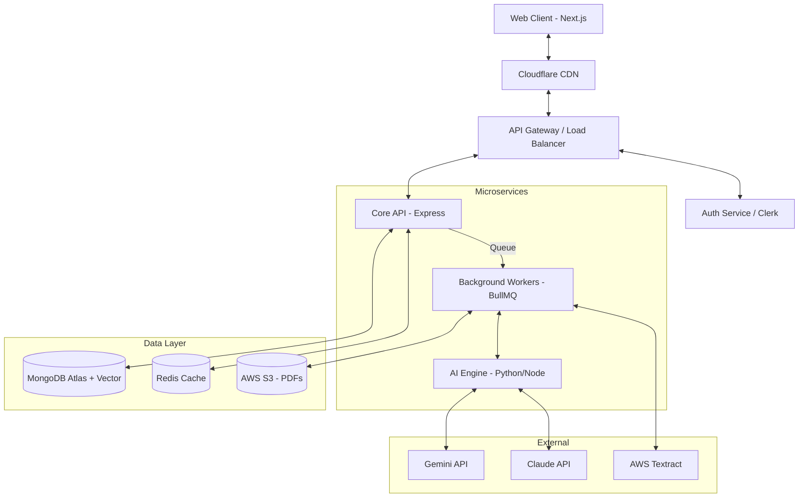
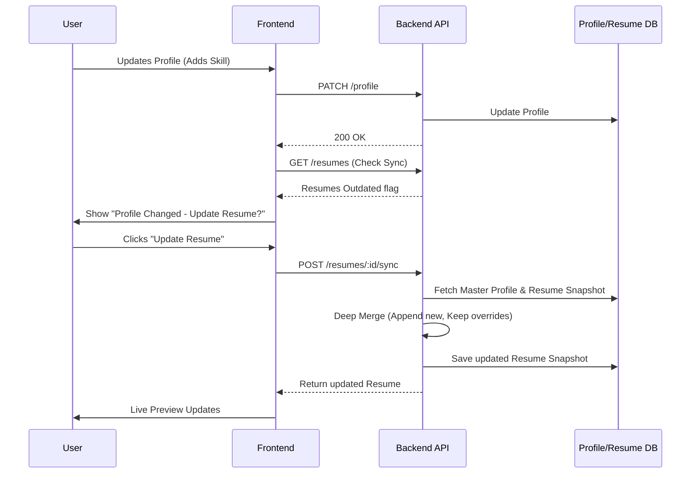

# Enterprise-Grade AI Resume Builder: SaaS Architecture & Design Document

## 1. Core Philosophy & System Overview
The **Student Profile** serves as the **Single Source of Truth (SSOT)**. Resumes are strictly treated as **projections (views)** or **snapshots** of this master profile. The system is designed for high concurrency, low-latency editing, and robust AI integration, comparable to top-tier SaaS products (Teal, Resume Worded).

---

## 2. Feature Architecture & Deep Dives

### Feature 1: Profile Synchronization
- **Detection Mechanism**: The system maintains a `versionHash` or `lastUpdatedAt` timestamp on the Master Profile. Each Resume instance stores the `profileVersionHash` it was last synced with. If `Profile.lastUpdatedAt > Resume.lastSyncedAt`, the UI flags the resume as "Outdated".
- **Sync Strategy**: When a user clicks "Update Resume", a diff engine compares the Master Profile with the Resume Snapshot. New items are appended; modified items prompt a conflict resolution UI if edited locally on the resume.
- **Data Model**: `Resume` entity stores a `snapshot` object containing the localized version of the profile data, rather than just referencing IDs, ensuring historical integrity.

### Feature 2: Resume Builder Core
- **Architecture**: Client-side state management (Zustand) for instant updates. Debounced auto-save (every 2s) to a Redis cache, flushed to MongoDB periodically or on user exit.
- **UX**: Split pane (Editor on left, Live PDF preview on right).
- **Features**: Drag & Drop (via `dnd-kit` or `framer-motion`), granular section toggles, robust theme engine (CSS variables mapped to user selections).
- **Versioning**: Implementing an Event Sourcing pattern or simple snapshotting (creating a `ResumeVersion` document on manual save or major milestone).

### Feature 3: Multiple Resume Versions
- **Architecture**: A 1-to-Many relationship between `Profile` and `Resume`. 
- **Visibility Toggles**: Instead of copying data, each `Resume` document stores a `visibilityMap` (e.g., `{ "projectId_1": true, "projectId_2": false }`) and `overrideMap` (for custom summaries or bullet points tailored to specific roles).

### Feature 4: Resume Parser
- **Parsing Workflow**: 
  1. Upload PDF/DOCX to AWS S3.
  2. Trigger async job via BullMQ.
  3. **OCR/Text Extraction**: AWS Textract or GCP Document AI (highest accuracy for complex layouts).
  4. **AI Extraction**: Send raw text/layout blocks to **Gemini 1.5 Pro** (large context window, excellent structured JSON output) to map to the standard Profile Schema.
- **Diff Engine**: Compares extracted JSON with existing Profile. UI presents a "Side-by-Side Merge" interface.

### Feature 5: ATS Analysis (Hybrid Approach)
- **Static Rule Engine**: Fast, deterministic. Checks boolean/numeric conditions (Missing Contact Info, Word Count, Bullet Count > 3, Action Verbs present via NLP dictionary like `compromise`).
- **AI Scoring Engine**: Semantic evaluation. Checks "Impact" (e.g., "Did they use STAR method?").
- **Profiles**: Role-specific scoring weights (e.g., Software Engineers need GitHub; Sales needs KPIs).

### Feature 6: Auto Fix
- **Architecture**: AI fixes are scoped to the exact JSON node (e.g., `resume.experience[0].bullets[1]`). The UI maintains an undo/redo stack locally before committing to the backend.

### Feature 7: AI Rewrite
- **Prompt Engineering**: Strict system prompts: *"You are an expert ATS resume writer. Rewrite the provided bullet point to be more impactful using the STAR method. DO NOT hallucinate metrics, companies, or skills not present in the prompt. Return ONLY the rewritten text."*

### Feature 8: Job Match
- **Architecture**: 
  1. Parse Job Description using Gemini/Claude.
  2. Extract Target Keywords (TF-IDF or LLM-based extraction).
  3. Compare against Resume vector embeddings (MongoDB Atlas Vector Search) and exact string matching.

### Feature 9: Live Preview
- **Rendering Strategy**: Use `@react-pdf/renderer`. For live web preview, render a DOM-based CSS grid that exactly mimics the PDF layout (faster than re-rendering a PDF blob on every keystroke). Only render the actual PDF blob on "Download" or "Print".

### Feature 10: Export
- **PDF/DOCX**: Rendered on the client using `@react-pdf/renderer` or backend using Puppeteer (PDF) and `docx` library (DOCX) to ensure perfect ATS-friendly formatting (parsable text layers, no image-based text).

### Feature 11: AI Chat (Resume Coach)
- **Conversation Architecture**: LangChain/LangGraph agent. The agent has access to tools: `get_resume_score`, `rewrite_section`, `suggest_skills`. Context includes the current resume JSON and the target job description.

---

## 3. Technology & AI Recommendations (Feature 13 & 14)

| Feature | Best Technology | Recommended AI Model | Why? |
|---------|----------------|----------------------|------|
| **Resume Parsing** | AWS Textract + LLM | **Gemini 1.5 Pro** | Huge context window (2M tokens) for complex PDFs, native JSON mode, highly accurate data extraction. |
| **AI Rewrite / Cover Letter** | LLM | **Claude 3.5 Sonnet** | Best-in-class natural language generation, empathetic tone, minimal hallucination, fast. |
| **ATS Scoring (Semantic)** | LLM | **OpenAI GPT-4o-mini** | Low latency, highly cost-effective for high-volume rapid evaluations. |
| **Template Rendering** | React / @react-pdf | N/A | Declarative, maintains consistency between Web UI and exported PDF. |
| **Background Jobs** | BullMQ (Redis) | N/A | Rock-solid for long-running AI and parsing tasks with built-in retries. |
| **Vector Search (Job Match)** | MongoDB Atlas Vector Search | N/A | Keeps operational DB and Vector DB unified. |

---

## 4. Database Design (Feature 15)

**MongoDB Collections:**
- `Profiles`: `_id`, `userId`, `personalInfo`, `experiences[]`, `education[]`, `skills[]`, `lastUpdatedAt`.
- `Resumes`: `_id`, `profileId`, `name`, `targetRole`, `templateId`, `theme`, `snapshot{}`, `visibilityMap{}`, `overrides{}`, `lastSyncedAt`.
- `ResumeVersions`: Immutable snapshots of `Resumes` saved at milestones.
- `AtsReports`: `_id`, `resumeId`, `overallScore`, `staticRuleResults[]`, `aiRuleResults[]`.
- `JobMatches`: `_id`, `resumeId`, `jobDescriptionText`, `matchScore`, `missingKeywords[]`.

---

## 5. API Design (Feature 16)

**RESTful API Examples:**
- `POST /api/v1/resumes/:id/parse` (Multipart Form Data) -> Triggers async parsing, returns `jobId`.
- `GET /api/v1/resumes/:id/parse/:jobId` -> Polling endpoint for parser results.
- `PATCH /api/v1/resumes/:id/sync` -> Force sync with Master Profile.
- `POST /api/v1/resumes/:id/analyze` -> Triggers ATS analysis.
- `POST /api/v1/ai/rewrite` -> Body: `{ "type": "bullet", "text": "...", "context": "..." }` -> Returns: `{ "rewrittenText": "..." }`.

---

## 6. Clean Architecture & Folder Structure (Feature 17)

```
backend/src/
├── domain/                  # Enterprise business rules (Entities, Value Objects)
│   ├── profile.entity.ts
│   ├── resume.entity.ts
├── application/             # Application logic (Use Cases)
│   ├── usecases/
│   │   ├── ParseResumeUseCase.ts
│   │   ├── AnalyzeAtsScoreUseCase.ts
│   │   ├── SyncProfileToResumeUseCase.ts
│   ├── interfaces/          # Ports (IAIService, IResumeRepository)
├── infrastructure/          # External agencies (DB, AI APIs, Textract)
│   ├── ai/
│   │   ├── GeminiService.ts # Implements IAIService
│   │   ├── ClaudeService.ts
│   ├── repositories/
│   │   ├── MongoResumeRepository.ts
├── presentation/            # Controllers, Routes (Express/NestJS)
│   ├── controllers/
│   │   ├── ResumeController.ts
```

---

## 7. Non-Functional Requirements (Security, Performance, Scalability)

- **Security**: 
  - **File Validation**: Magic number checking (not just extension) to prevent malicious uploads.
  - **Virus Scanning**: ClamAV on S3 buckets for uploaded PDFs.
  - **Data Privacy**: PII redaction before sending to third-party LLMs (crucial for enterprise compliance).
- **Performance**:
  - **Caching**: Redis for AI responses (e.g., if a student asks for an auto-fix on the exact same bullet point, return cached result).
  - **Lazy Loading**: Only load the PDF renderer module when the user navigates to the preview tab.
- **Scalability**:
  - Stateless API deployed on Kubernetes or AWS ECS, auto-scaling based on CPU/Queue depth.
  - Read-heavy architecture: CQRS pattern. Resume read operations hit MongoDB read replicas.

---

## 8. System Diagrams (Feature 21)

### System Architecture


### Resume Generation & Sync Flow


---

## 9. Staff Engineer Review & Final Recommendations (Feature 22)

**Critique & Missing Production Features:**
1. **PII Redaction (Critical)**: Sending raw student data to external LLMs (OpenAI/Anthropic) violates data privacy standards for many educational institutions (FERPA compliance in the US). You **must** implement a PII Redaction layer (e.g., Microsoft Presidio) before data hits the AI.
2. **Telemetry & Observability**: You need distributed tracing (OpenTelemetry, Datadog) to track AI latency. If Gemini takes 15 seconds to parse a resume, the UI needs a robust polling/websocket mechanism to handle this gracefully, not a hanging HTTP request.
3. **Cost Control Strategy**: LLM calls are expensive. Implement semantic caching (Redis + Vector) so common queries ("Rewrite 'fixed bugs' using STAR method") don't incur LLM costs repeatedly.

**Features to Outperform Competitors (Teal, Resume Worded):**
- **Hyper-Targeted AB Testing**: Allow students to generate two variations of a resume for a single job description, track which one gets a callback, and feed that back into the global AI model.
- **Chrome Extension Integration**: Allow students to extract a job description directly from LinkedIn/Indeed and instantly click "Generate Tailored Resume", skipping the copy-paste step entirely.
- **Real-Time Market Data**: Connect the ATS rule engine to live market data (e.g., "React is trending down in your area, consider emphasizing Next.js based on recent job postings").

**Conclusion**: The architecture proposed above is highly decoupled, asynchronous, and scalable. By treating the Profile as the absolute SSOT and leveraging a multi-LLM strategy (Gemini for extraction, Claude for generation, GPT-4o-mini for rapid scoring), CareerHub will possess a deeply competitive, enterprise-grade AI Resume Builder.
